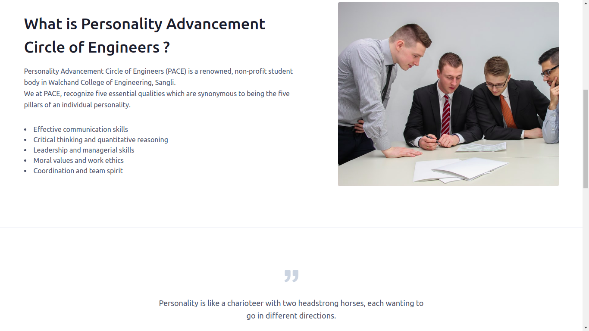

# PACE

Personality Advancement Circle of Engineers (PACE) is a renowned, non-profit student body in Walchand College of Engineering, Sangli.
We at PACE, recognize five essential qualities which are synonymous to being the five pillars of an individual personality.

https://wcepace.org/

